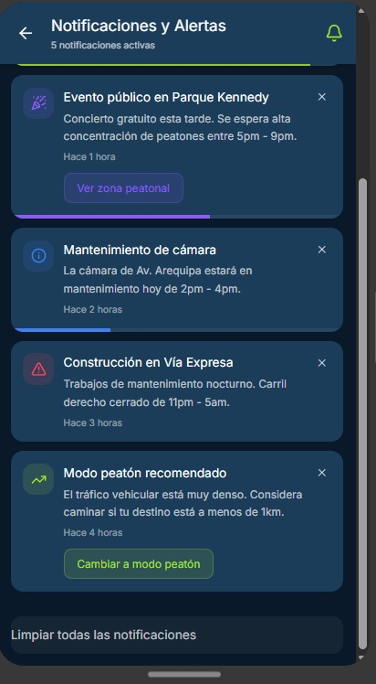

#  Pantalla de Alertas — Veyro

Esta pantalla muestra las **notificaciones y avisos inteligentes** del sistema.  
Incluye alertas por:
- Accidentes o eventos en tiempo real  
- Cambios climáticos que afectan la movilidad  
- Congestión inesperada en ciertas zonas  
- Recomendaciones de rutas alternativas  

El diseño mantiene una **paleta en azul y verde lima**, priorizando la legibilidad y el contraste.  
Los íconos de alerta son **claros y minimalistas**, con colores intuitivos según nivel de prioridad.

