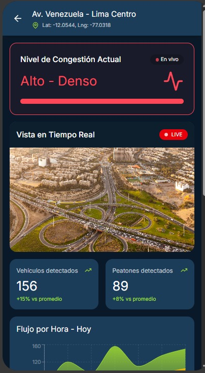
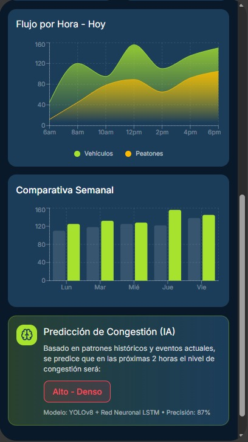
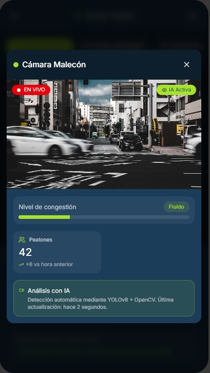

# 🗺️ Mapas Urbanos — Veyro

Las pantallas de mapas son el **núcleo visual** de Visiora.  
Muestran el **flujo vehicular y peatonal en tiempo real**, con capas dinámicas de información.

Elementos principales:
- Colores de congestión: 🟢 fluido · 🟡 moderado · 🔴 denso  
- Íconos de cámaras urbanas (clicables para mostrar vista simulada)  
- Filtros por zonas, avenidas o distritos  
- Mapas de calor para visualizar densidad de personas o vehículos  

La visualización combina **tecnología y accesibilidad**, permitiendo a cualquier ciudadano comprender fácilmente la situación de la ciudad.

