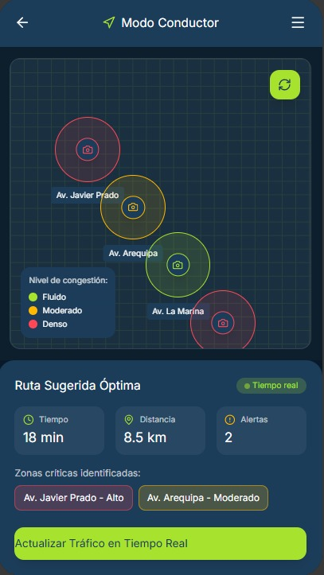
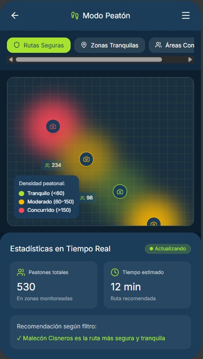

# 🚗👣 Modos de Uso — Veyro

Visiora ofrece dos modos principales de interacción:

## 🚗 Modo Conductor
Muestra rutas óptimas según tráfico actual, cámaras en tiempo real y predicción de congestión.  
Incluye botones de acción rápida: “Actualizar tráfico” y “Ver rutas alternativas”.

## 👣 Modo Peatón
Visualiza el flujo peatonal mediante mapas de calor.  
Permite filtrar por **rutas seguras**, **zonas concurridas** o **áreas tranquilas**.  
Ideal para moverse con seguridad y eficiencia.

Ambas interfaces mantienen consistencia visual y botones grandes para facilitar el uso mientras se está en movimiento.

